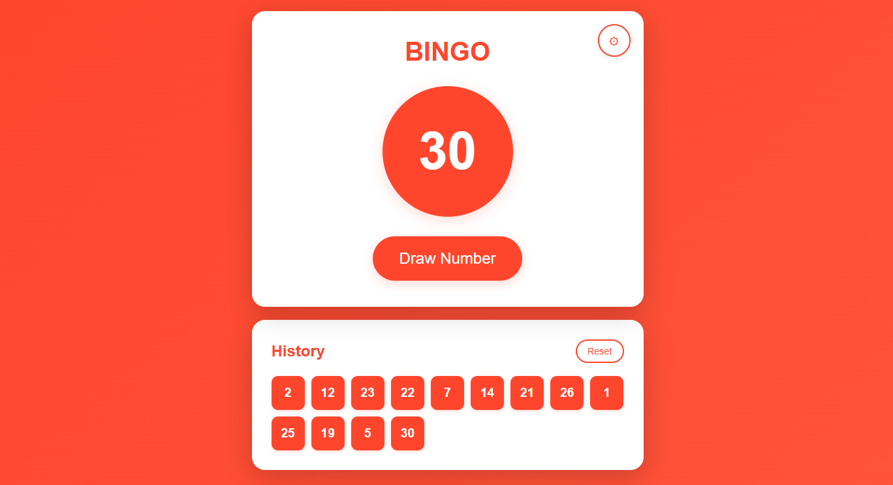

# Bingo Number Generator

A modern, web-based bingo number generator with customizable settings and an intuitive user interface. This is a standalone, no internet required quick bingo solution - simply open the HTML file in any browser and start playing immediately.

## Features

### Random Number Drawing
- Draw random numbers one at a time with a single click
- Animated number display with pop effect
- Prevention of duplicate numbers
- Clear visual feedback for each drawn number

### History Tracking
- Complete history of all drawn numbers displayed in a grid layout
- Real-time updates as numbers are drawn
- Quick reset functionality to start a new game
- Chronological display showing the order of drawn numbers

### Customizable Settings
- **Theme Color**: Choose any color using a color picker to customize the entire interface
- **Number Range**: Set custom minimum and maximum values for the number pool
  - Default range: 0-100
  - Flexible range settings to accommodate different bingo game variations
- **Persistent Storage**: Settings are saved to browser localStorage and persist across sessions

## How to Use

1. Open `index.html` in a web browser
2. Click the "Draw Number" button to draw a random number
3. View the history of drawn numbers in the grid below
4. Click the gear icon to access settings:
   - Select a theme color
   - Set the minimum number
   - Set the maximum number
   - Click "Save" to apply changes
5. Use the "Reset" button to clear the history and start a new game

## Technical Details

- Single HTML file application (no dependencies)
- Pure JavaScript implementation
- CSS3 animations and transitions
- LocalStorage for settings persistence
- Validates settings to prevent invalid number ranges
- Dynamic theme color application across all UI elements

## Settings Validation

The application includes built-in validation:
- Minimum number must be less than maximum number
- Minimum number must be 0 or greater
- Alert notifications for invalid configurations

